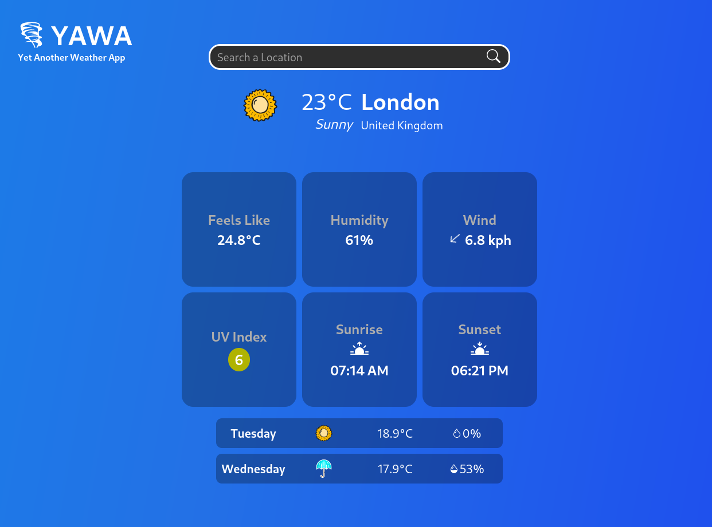

# Weather App
#### _Course of [The Odin Project](https://www.theodinproject.com/lessons/node-path-javascript-weather-app)_

### [Live Link](https://louispallett.github.io/odin-weather-app/)

YAWA (Yet Another Weather App) A simple weather app, as part of the FullStack JS course on "The Odin Project".

## Purpose

Obviously the live page is used to search and find information on the current weather and the weather over the next couple of days.

The secondary purpose is to test and develop skills in front-end development - particularly for fetching and displaying data from an API. It also builds on my familiarity working with Webpack, SCSS, and packages such as date-fns. Not to mention my ability to style an webpage!

## Technology

This application relies on a few packages, the full list of which is available in the package.json file. The following development dependencies are used:

- [Autoprefixer](https://www.npmjs.com/package/autoprefixer)
- [Webpack](https://webpack.js.org/)
- [SASS](https://sass-lang.com/)

And the following dependencies:

- [Date-fns](https://date-fns.org/)

All weather data is also fetched from the [Open WeatherAPI](https://openweathermap.org/api).

## Image Acknowledgements:
| Image | Source |
| ----------- | ----------- |
| Tornado Icon | 'game-icons.net' from https://www.svgrepo.com/svg/321607/tornado |
| droplet svg | files (full, empty, and half) from bootstrap icons. |
| sunny.svg | 'Good Stuff No Nonsense' from https://www.svgrepo.com/svg/440537/sun |
| rainy.svg | 'SVG Repo' from https://www.svgrepo.com/svg/146977/rain |
stormy.svg | 'humbleicons' from https://www.svgrepo.com/svg/470897/storm
| snowy.svg | 'Icooon Mono' from https://www.svgrepo.com/svg/481902/snowman-4 |
cloudy.svg | 'SVG Repo' from https://www.svgrepo.com/svg/192965/cloudy-cloud
| foggy.svg | 'joypixels' from https://www.svgrepo.com/svg/401818/fog |